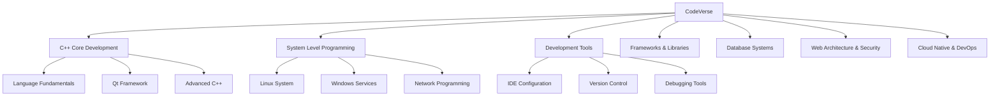

# CodeVerse | 技术宇宙

> A professional technical knowledge base built with Hexo static site generator and Butterfly theme, featuring comprehensive development documentation and tutorials.

## 🎯 Business Overview

**CodeVerse | 技术宇宙** is a centralized technical documentation platform that provides high-quality tutorials, best practices, and solution guides for software developers and IT professionals. The blog serves as:

- **Technical Knowledge Hub** - Curated collection of development tutorials and architectural guides
- **Professional Reference** - Quick access to proven solutions and code examples
- **Learning Platform** - Structured content from beginner to advanced topics
- **Community Resource** - Sharing practical insights and industry best practices

### Content Coverage

- **C++ Development** - Core language features, Qt framework, system programming
- **Web Architecture** - Server configuration, security, deployment strategies
- **DevOps & Cloud** - Containerization, CI/CD, cloud services management
- **Development Tools** - IDEs, version control, debugging and optimization
- **Database Systems** - Design, optimization, and administration

## 🛠️ Technology Stack

### Core Technologies

| Technology | Version | Purpose |
|------------|---------|---------|
| **Hexo** | 8.1.1 | Static site generator |
| **Butterfly Theme** | 5.5.3 | Professional blog theme |
| **Node.js** | - | Runtime environment |
| **GitHub Pages** | - | Hosting platform |

### Hexo Plugins & Extensions

```json
{
  "hexo-abbrlink": "^2.2.1",          // Persistent link generation
  "hexo-deployer-git": "^4.0.0",      // Git deployment automation
  "hexo-generator-archive": "^2.0.0", // Archive page generation
  "hexo-generator-baidu-sitemap": "^0.1.9", // Baidu sitemap
  "hexo-generator-category": "^2.0.0", // Category page generation
  "hexo-generator-feed": "^3.0.0",    // RSS Feed generation
  "hexo-generator-index": "^3.0.0",   // Homepage generation
  "hexo-generator-json-content": "^4.2.3", // JSON content for search
  "hexo-generator-searchdb": "^1.5.0", // Search functionality
  "hexo-generator-sitemap": "^3.0.1", // Sitemap generation
  "hexo-generator-tag": "^2.0.0",     // Tag page generation
  "hexo-renderer-ejs": "^2.0.0",      // EJS template rendering
  "hexo-renderer-marked": "^6.3.0",   // Markdown rendering
  "hexo-renderer-pug": "^3.0.0",      // Pug template rendering
  "hexo-renderer-stylus": "^3.0.1",   // Stylus CSS rendering
  "hexo-server": "^3.0.0"             // Local development server
}
```

## 🏗️ Architecture

### Directory Structure

```
blog/
├── _config.yml              # Hexo main configuration
├── _config.butterfly.yml    # Butterfly theme configuration
├── package.json             # Node.js dependencies
├── source/                  # Source content directory
│   ├── _posts/             # Blog posts organized by category
│   │   ├── 01-CPP核心语言/
│   │   ├── 02-系统级编程/
│   │   ├── 03-开发工具/
│   │   ├── 05-框架库/
│   │   ├── 06-数据库系统/
│   │   ├── 07-Web架构安全/
│   │   └── 08-云原生运维/
│   ├── about/              # About page
│   ├── categories/         # Category pages
│   ├── tags/              # Tag pages
│   └── images/            # Static images and assets
├── themes/                # Theme files
├── public/               # Generated static site
├── .deploy_git/         # Git deployment cache
└── node_modules/        # Node.js dependencies
```

### Content Organization

The blog uses a hierarchical categorization system:



## 🚀 Quick Start

### Prerequisites

- **Node.js** (v14 or higher)
- **Git** for version control
- **GitHub account** for deployment

### Installation

1. **Clone the repository**
   ```bash
   git clone https://github.com/lucaswang420/blog.git blog
   cd blog
   ```

2. **Install dependencies**
   ```bash
   npm install
   ```

3. **Local development**
   ```bash
   npm run server
   # or
   hexo server
   ```

   Visit `http://localhost:4000` to preview the blog.

### Basic Workflow

1. **Create new post**
   ```bash
   npm run new "Your Post Title"
   # or
   hexo new "Your Post Title"
   ```

2. **Local preview**
   ```bash
   npm run server
   # or
   hexo server
   ```

   Visit `http://localhost:4000` to preview changes

3. **Generate static site**
   ```bash
   npm run build
   # or
   hexo generate
   ```

4. **Deploy to GitHub Pages**
   ```bash
   npm run deploy
   # or
   hexo deploy
   ```

5. **Clean and rebuild**
   ```bash
   npm run clean
   npm run build
   ```

## 📝 Content Management

### Post Front Matter

Each blog post requires YAML front matter:

```yaml
---
title: "Article Title"
date: 2025-12-17 16:30:00
author: "lucas"
tags: [Tag1, Tag2, Tag3]
categories: [MainCategory, SubCategory]
description: "Brief description of the article content"
---
```

### Content Standards

- **Language**: Primarily Chinese with technical English terms
- **Format**: Markdown with proper syntax highlighting
- **Structure**: Clear headings, code examples, and practical explanations
- **SEO**: Optimized titles, descriptions, and relevant tags

### Category Structure

Content is organized into 8 main categories:

1. **C++ Core Language** (`01-CPP核心语言`)
2. **System Level Programming** (`02-系统级编程`)
3. **Development Tools** (`03-开发工具`)
4. **Frameworks & Libraries** (`05-框架库`)
5. **Database Systems** (`06-数据库系统`)
6. **Web Architecture & Security** (`07-Web架构安全`)
7. **Cloud Native & DevOps** (`08-云原生运维`)

## 🔧 Configuration

### Main Configuration (`_config.yml`)

Key settings in the main Hexo configuration:

```yaml
# Site Information
title: CodeVerse | 技术宇宙
author: lucas
language: en
url: https://lucaswang420.github.io
permalink: posts/:abbrlink/

# Theme
theme: butterfly

# Search Configuration
jsonContent:
  posts:
    title: true
    date: true
    path: true
    text: false
    tags: true

# Deployment
deploy:
  type: git
  repo: git@github.com:lucaswang420/lucaswang420.github.io.git
  branch: main
```

### Theme Configuration (`_config.butterfly.yml`)

The Butterfly theme provides extensive customization options:

- **Style Settings** - Color schemes, fonts, layout
- **Menu Configuration** - Navigation structure
- **Social Links** - GitHub, LinkedIn, etc.
- **Analytics** - Google Analytics, Baidu Tongji

## 🔍 Search Functionality

The blog includes a powerful search feature powered by `hexo-generator-searchdb`:

- **Full-text search** across all blog posts
- **Real-time results**
- **Performance optimized**

### Search Usage

1. Click the search icon
2. Enter keywords
3. View matching results
4. Click results to navigate to articles

## 🚀 Deployment

### Automated Deployment

The blog uses automated deployment to GitHub Pages:

```bash
# Single command deployment
hexo deploy
```

### Deployment Configuration

The deployment is configured in `_config.yml`:

```yaml
deploy:
  type: git
  repo: git@github.com:lucaswang420/lucaswang420.github.io.git
  branch: main
  message: "Site updated: {{ now('YYYY-MM-DD HH:mm:ss') }}"
```

## 🛠️ Development Workflow

### Local Development

1. **Start development server**
   ```bash
   npm run server
   ```

2. **Live reload** - Changes are automatically reflected

### Git Workflow

```bash
# 1. Create feature branch
git checkout -b new-article

# 2. Add content
git add .
git commit -m "Add new technical article: [Title]"

# 3. Deploy changes
hexo generate
hexo deploy

# 4. Merge to main
git checkout main
git merge new-article
git push origin main
```

## 📈 Current Statistics

- **Total Articles**: 100+ technical articles
- **Categories**: 8 main categories with 20+ subcategories
- **Update Frequency**: Weekly content additions

## 🔗 Related Projects

- [Knowledge Base Repository](../) - Main documentation repository
- [Blog Automation Tools](../blog-tools/) - Content management automation
- [Documentation Standards](../docs/standards/) - Writing and formatting guidelines

---

*Last updated: December 2025*
*Maintainer: lucas*
*License: MIT*